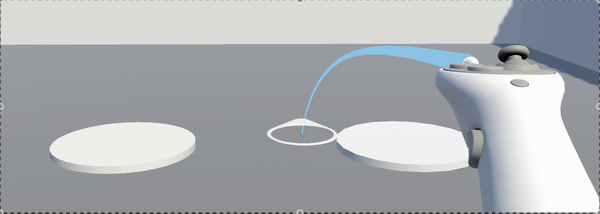
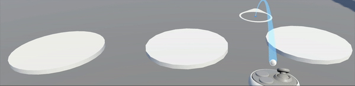
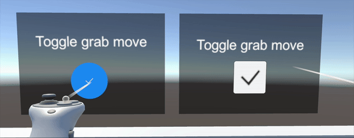
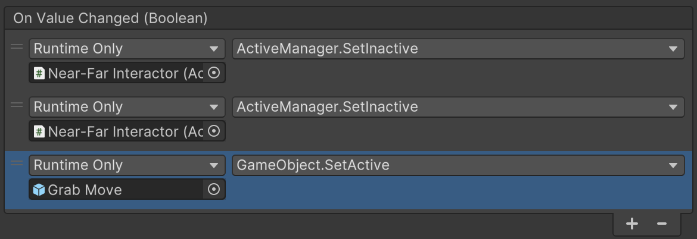

# Week 4: Create your own game!

## Objectives
- Create a VR game from scratch
- Get comfortable with basic XR interactions
- Get comfortable using the components and samples of XRIT

## Introduction
In this tutorial, we will create various activities, each utilizing Unity and XR features. We assume you are familiar with Unity basics and have some prior minimal experience with XR features. The goal is to develop a comprehensive understanding of the process of creating a VR game, rather than simply following step-by-step instructions.

If something is unclear, try to research it online and consult the recommended resources from previous weeks. If the issue persists, feel free to ask our staff for assistance.

Remember to test and build your game frequently by playing it on your headset or using the device simulator. This helps ensure the game builds correctly and makes it easier to identify potential bugs early on.

We also recommend committing your changes regularly. Ideally, the game should be in a playable state after every commit.

## Set up the project
As covered in previous weeks, first create a new project and set it up for VR. You can find instructions to set up your Unity project either in the HO2 or in the `unity_setup.md` resource from the [class repository](https://github.com/cs444-epfl/cs444.git).

Make sure you are able to play (using the `XR Device Simulator`) and build the `DemoScene` for your headset before going to the next step.

## Create a blank VR scene
First, open the automatically created `SampleScene` and delete the existing `Main Camera` object: the XR rig will have its own camera.

The `Starter Assets` sample provides a default `XR Origin` prefab (`Samples > XR Interaction Toolkit > {version} > Starter Assets > Prefabs > XR Origin (XR Rig)`). You can simply drag & drop it into the current scene.

By default, gravity is enabled. You can add a floor by adding a new plane to avoid falling forever in the void.

This prefab tracks the headset and controllers positions. It also provides several default game mechanics such as 

- Continuous move
- Teleportation
- Continuous rotation
- Snap rotation
- Climb
- Grab move (disabled by default)
- Near interaction
- Far interaction
- Poke interaction 
- Socket interaction

Make sure you understand the role of each of these features. If that's not the case, look it up online.

The default key bindings are:

- **Left hand**:
  - **Joystick**: move continuously in a direction
  - **Grip button**: grab objects
  - **Trigger button** or **poke interactor**: interact with the UI

- **Right hand**:
  - **Joystick**:
    - **Up**: enable the teleportation ray, release to teleport
    - **Down**: snap rotate by 180 degrees
    - **Left** / **Right**: snap rotate by 45 degrees
  - **Grip button**: grab objects
  - **Trigger button** or **poke interactor**: interact with the UI

As stated in the project requirements: in your project, you need to make use of **all** these provided mechanics along with some you develop on your own.  

Remember to test (building or using the device simulator) your game after every step to make sure you didn't break anything by mistake.

It is also a good time to make a commit: "Adapt SampleScene to VR"

## Add Teleportation
### Prerequisites
You should be familiar with the following concepts:

- Unity Editor
- Prefabs
- `Collider`
- `XROrigin`
- `RayInteractor`
- XR interactables
- XR teleportation

### Concepts
You'll learn about the following concepts:

- `TeleportationArea`
- `TeleportationAnchor`
- `XRInteractableSnapVolume`
- User feedback
- Affordance System

### `TeleportationArea`
Making an object a `TeleportationArea` means the player can teleport anywhere on its surface (defined by their `Collider` component).

Let's make the floor a `TeleportationArea` so that we can move freely using teleportation:

- Add a `TeleportationArea` component
- Set the `Interaction Layer Mask` to `Teleport` (this will prevent the near-far interactors detecting to the floor as interactable)
- Try to set and unset `Teleportation Configuration > Match Orientation > Match Directional Input` to understand the effect of this parameter. We recommend setting it.

You should now be able to teleport anywhere on the floor by setting your right joystick forward and releasing it.

Good time to commit: "Make the floor a TeleportationArea"

### `TeleportationAnchor` 
Another basic component for teleportation is the `TeleportationAnchor`. Instead of being teleported anywhere on the surface, with any orientation, an anchor fully controls the position and/or the rotation of a player upon teleportation.

We will recreate the `Snap Teleport Anchor` (`Assets/Samples/XR Interaction Toolkit/3.0.7/Starter Assets/DemoSceneAssets/Prefabs/Teleport/Snap Teleport Anchor.prefab`) prefab from the _Starter Assets_ sample.

- Create a cylinder and make it almost flat. This will be the platform on which we will teleport. Replace the existing `Capsule Collider` with a `Box Collider` (to prevent unnatural collisions with the player).
- Add an empty child, named "Anchor" and position it slightly above the cylinder. If you don't set it higher than the cylinder, in next section, your cursor will be inside the cylinder and become invisible.
- Add a `TeleportationAnchor` component to the cylinder
  - Again, set the `Interaction Layer Mask` to `Teleport`
  - We want the player to match the position **and** rotation (face the `Z` direction) of the anchor: Set `Teleportation Configuration > Match Orientation` to `Target Up And Forward`

If you try to play, you can already correctly use the anchor. However it is not obvious for the player that this is a teleportation point. 

Good time to commit: "Create a TeleportationAnchor"

#### `XRInteractableSnapVolume`

Let's give a better feedback to the user. First we will make the cursor snap when it is in range of teleportation:



- Remove the collider from the anchor: It will be replaced by a larger snap volume collider (when the cursor enters this collider, it gets snapped to a specified point)
- Add a new child with a generous box collider: this will be our snap volume
- Add a `XRInteractableSnapVolume` component to this child. Assign your new box collider to the `Snap Collider` parameter.

Now the cursor snaps to the anchor! But we could improve the user experience one further step by adding more feedback to it.

#### Affordance System

Let's change the color of the anchor when it is selected for teleportation: 



For such feedback, Unity provides an [Affordance System](https://docs.unity3d.com/Packages/com.unity.xr.interaction.toolkit@2.3/manual/affordance-system.html). However it is now deprecated without any official replacement (one should be coming soon). We still recommend using this deprecated system until the more recent feedback system becomes available. We recommend following [this tutorial](https://www.youtube.com/watch?v=yiqKxARw0VE) which shows the basics of the affordance system. You can also find examples in the `DemoScene` from
the _Starter Assets_ sample.

- Add an `InteractionAffordance` (`Assets/Samples/XR Interaction Toolkit/3.0.7/Starter Assets/DemoSceneAssets/Prefabs/InteractionAffordance.prefab`) prefab as a child of your teleport anchor.
  You can safely ignore `Hover`, `Focus`, and `Activate` events since, thanks to the snap volume, only `Select` events will get triggered.
- Set the `Renderer` field of the `Material Property Block Helper` to the renderer of your cylinder
- A default `ColorAffordanceThemeDatum` is provided with the _Starter Assets_ sample. However, feel free to create your own!

Good time to commit: "Add feedback to the teleportation anchor"

#### Other feedback

Additional user feedback can be added such as haptic or audio feedback. In your project, we ask you to give extensive feedback to the user. It allows your game to be intuitively understood by the player without an explicit tutorial.

## Add Grab Interaction: Water pistol
### Prerequisites
You should be familiar with the following concepts:

- Unity Editor
- Prefabs
- `MonoBehaviour`
- `Rigidbody`
- `Collider`
- Events
- XR interactables
- XR grab interactions
- XR near-far interactions

### Concepts
You'll learn about the following concepts:  

- `NearFarInteractor`
- `XRGrabInteractable`
- `XRGeneralGrabTransformer`
- Game "juice"

### Simple grab interaction
First add a simple cube interactable (`Hierarchy (right click) > XR > Grab Interactable`) and make sure you are able to grab it using the XR Simulator Device.

Have a look at the `Collider`, `Rigidbody`, `XRGrabInteractable` and `XRGeneralGrabTransformer` components. These are the required components for a grab interactable object.  
Also note the automatically created `XR Interaction Manager`. One such object is required to have XR interactions in our scene.

### Water pistol
We will use 3D assets from the [Synty POLYGON - Start Pack](https://assetstore.unity.com/packages/essentials/tutorial-projects/starter-pack-synty-polygon-stylized-low-poly-3d-art-156819) which is free on the asset store. You are free to use any other assets you want.

You can now delete this simple cube, we'll create our own interactable object, a water pistol:
- Add a pistol prefab (`Assets/PolygonStarter/Prefabs/SM_Wep_WaterPistol_01.prefab`)
- Replace the existing mesh collider with a generous box collider
- Add a rigid body and set `Interpolate` to `Interpolate`. If you don't set it, the object will not interpolate its position between frames while following your hand: a jitter effect may appear when moving fast.
- Add an `XRGrabInteractable`
- Add an `XRGeneralGrabTransformer`: it gives us more control on how we want the grab interaction to happen

Try to play and grab the pistol. Notice how you can grab it with the far interactor. Ideally we would like the pistol to come in our hand for a more natural feeling: Setting `XRGrabInteractable > Far Attach Mode` to `Near` will exactly solve this issue by forcing this object to come in our hand whenever we interact with it using the far interactor.

Nice! But now we'd like to hold the pistol by the handle... The `XRGrabInteractable > Attach Transform` allows you to choose the exact point that will follow your hand position and rotation. Create an empty child to the pistol and assign `Attach Transform` to it. Move this child around to achieve the desired effect.

It would be nice to shoot some water out of this pistol... For this, we'll need a custom script:

- Detecting if the player is currently grabbing the pistol
- Detecting if the player presses the trigger button
- Shooting a given water prefab if both are the case

Create a new `MonoBehaviour` script called `Shooter`, this will be a generic shooting component (not necessarily a water pistol):

Add three private serialized fields: one for the muzzle of the gun (where the bullet will spawn), one for the bullet prefab we will shoot and one for the force at which we will shoot it

```cs
  [SerializeField, Tooltip("Where to spawn the bullet")] private Transform muzzle;
  [SerializeField, Tooltip("The bullet to spawn")] private GameObject bulletPrefab;
  [SerializeField, Tooltip("The force at which the bullet will be shot")] private float force = 10f;
```

_Note: When collaborating with other people on a project, it is a good idea to keep fields private whenever you can. This way, you define clear APIs and it is easier for your colleagues to understand your code. Furthermore, try to add tooltips and documentation to your fields and classes._

Then, define a `Shoot()` function: which will spawn the serialized bullet and apply a force on it

```cs
public void Shoot()
{
    GameObject bullet = Instantiate(bulletPrefab, muzzle.position, Quaternion.identity);
    Rigidbody rb = bullet.GetComponent<Rigidbody>();
    rb?.AddForce(muzzle.forward * force, ForceMode.Impulse);
}
```

_Note: The `?.` operator is called the [null conditional operator](https://learn.microsoft.com/en-us/dotnet/csharp/language-reference/operators/member-access-operators#null-conditional-operators--and-)._

The entire script:

```cs
using UnityEngine;

/// <summary>
/// Class <c>Shooter</c> shoots a bullet when the attached
/// XRGrabInteractable is activated.
/// </summary>
public class Shooter: MonoBehaviour
{
    [SerializeField, Tooltip("Where to spawn the bullet")] 
    private Transform muzzle;
    [SerializeField, Tooltip("The bullet to spawn")] 
    private GameObject bulletPrefab;
    [SerializeField, Tooltip("The force at which the bullet will be shot")] 
    private float force = 10f;

    /// <summary>
    /// Method <c>Shoot</c> shoots the bullet prefab at a 
    /// certain force, all specified by this <c>Pistol</c>.
    /// </summary>
    public void Shoot()
    {
        var bullet = Instantiate(bulletPrefab, transform.position, Quaternion.identity);
        var rb = bullet.GetComponent<Rigidbody>();
        rb?.AddForce(transform.forward * (10 * force), ForceMode.Impulse);
    }
}
```

_Note: Our class needs to inherit from `MonoBehaviour` to use the `Instantiate` function. In general, try to stick with regular classes and avoid inheriting from `MonoBehaviour` when it is not necessary_

_Note: This implementation requires you to manually pass the `Shoot` function to the `activated` event of the pistol in the inspector. It makes it easy to forget the reference, breaking the functionality. A more robust implementation would be to reference a parent `XRGrabInteractable` and subscribe to its `activated` event directly in the script. You can find such an implementation in the GitHub project_

You can now add the `Pistol` component to the pistol. We need to link the `activated` event to our `Shoot()` method: `XR Grab Interactable > Interactable Events > Activate > +`, drag and drop the pistol object and choose `Shooter.Shoot`. 

If you try to run the game, grab the pistol and click on the trigger button you'll notice an error appearing in the console. This happens because we didn't provide any bullet prefab to our script. 

Let's create a water droplet prefab: a simple blue 3D sphere with a rigid body and a sphere collider components attached. You can also try adding a script to destroy the droplet on any collision or after a certain time (to avoid surcharging your scene with too many droplets), the solution is on GitHub.

If you assign the `Shooter > BulletPrefab` field to our newly created water prefab, you'll see them spawn when clicking the trigger button.

That's a very basic interaction. If you wished to have such a shooting interaction in your game you'd have to add some more "[juice](https://www.youtube.com/watch?v=3tvoUAPx5FY)" to make the game fun to play. 

Here are some other examples:

- Link the pistol to the Affordance System
- Audio and haptic feedback
- Effects (particles, paint spot, ...)
- Limited ammunition with a reloading mechanism

Good time to commit: "Create a water pistol"

## Add a UI
### Prerequisites
You should be familiar with the following concepts:

- Unity Editor
- Prefabs
- UI in Unity: `Canvas`, `Toggle`, `Image`, `EventSystem`, Layout Groups, ...
- Events
- XR poke interaction

### Concepts
You'll learn about the following concepts: 

- UI for XR
- `XRPokeInteractor`

Let's make a simple UI. This UI is heavily inspired from the demo scene from the _Starter Assets_ sample.

First, create a canvas suited for XR (`XR > UI Canvas`). This will automatically create an attached `EventSystem` object also suited for XR, required for UI interaction.

Give it a width of 1000 and a height of 360. This will ensure a high UI resolution. However, it is now huge: scale it down to 0.002 to give it a reasonable size.

Add an `Image` component for the background and set the color of your choice. We recommend adding some transparency.
Finally, add a `VerticalLayoutGroup` component to organize children vertically.

You should now populate our canvas with two elements:

- A child `Text` component with "Toggle grab move" text content
- A `Toggle` child element. You can customize it as you like (you can find great examples in `DemoScene` from the _Starter Assets_ sample)

You should obtain a similar result:



_On the left is an example from the `DemoScene`_

Try to interact with the UI using the poke interactor.

### Grab move
Let's use our UI to actually toggle the grab move feature (as indicated by the text)  
The `Toggle` component exposes a public event `OnValueChanged(Boolean)`. 
You should enable the `XR Origin (XR Rig) > Locomotion > Grab Move` component when this event is fired with `true` and disable it when it is fired with `false`.  
Conversely, you need to disable the two `XR Origin (XR Rig) > Locomotion > Left/Right Controller > NearFarInteractor` for each hand when the toggle is set to `true` to avoid grabbing object when you only want to move. Your inspector view should look like:



_Note: Make sure to select the `Dynamic bool` parameter and not `Static Parameters`_

You should now be able to switch between grab move and near-far interaction using the UI.

Good time to commit: "Create a UI to toggle grab move"

## Add a Snap Interactor
### Prerequisites
You should be familiar with the following concepts:

- Unity Editor
- Prefabs
- XR Interactors
- Grab interactions

### Concepts
You'll learn about the following concepts: 

- `XRSocketInteractor`

Snap interactors allow to snap objects in a specific position and/or rotation. For example, you can put a book in a specific spot in a shelf, or attach some clothes to a mannequin.

Let's add a mannequin and attach a sword and a shield to their hands:

- Add a character model of your choice (`Assets/PolygonStarter/Prefabs/Characters/SM_Character_{Female/Male}_01.prefab`).
- Add a sword (`Assets/PolygonStarter/Prefabs/SM_PolygonPrototype_Prop_Sword_01.prefab`) and a shield (`Assets/PolygonStarter/Prefabs/SM_Wep_Shield_04.prefab`) prefabs

We want the sword and the shield to snap into their hand when they're close enough:

- Make both the sword and the shield grab interactables (make sure to set the attach point to a point which makes sense)
- Add a `XRSocketInteractor` in each of the mannequin's hands. When an interactable enters the socket, it will be snapped in placed (with a blue preview). Make sure to set the correct orientation for your socket

Good time to commit: "Create mannequin activity"

## Your own ideas
Feel free to implement any other features that come to your mind to get comfortable using this tool. The broader your knowledge about the toolkit is, the more ideas you'll be able to implement and the better your game will be!

Remember to check the project description document, which lists lots of cool ideas that you could try to protoype.
